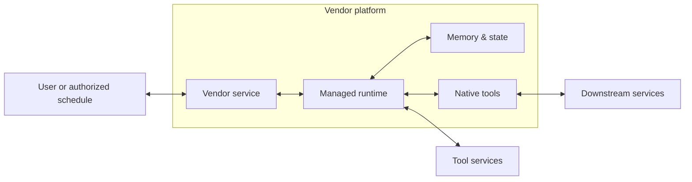

# Managed runtime coverage — October 2026 update

**Assessment date: 2026-10-03.** Recommendations only; no architecture or tooling records changed. Two subagents independently checked the local revisions and Grok Bot evidence. The lead assessed Dots, the Agents API and the shared classification.

## Recommended catalogue shape

**Keep hosted task sessions and API/SDK managed runtimes; add one sibling for persistent hosted agents.** Preserve general desktop/document tasks in the session family through an explicit completion/action profile. A pull-request merge is suitable for coding work, but cannot be the universal security gate for desktop work.

This refines the earlier HS-07 recommendation to narrow the whole session architecture to coding. The simpler long-term structure is three execution contracts, with product-specific profiles. The catalogue currently has 16 architectures; the additional persistent reference would make 17. No additional reference is needed for each vendor, messaging channel or browser feature.

| Reference | Defining contract | Modes it should cover | Required correction |
| --- | --- | --- | --- |
| **Hosted task sessions** — existing `archHostedAgentSessions` | User/product service starts bounded work in a task environment; results and retained artifacts have stated lifetimes. | Coding sessions; general desktop/document tasks; scheduled task initiation. | Two explicit outcome profiles: reviewed code promotion, or authorized application/file effects. State what persists after compute ends. |
| **Persistent hosted agents** — proposed sibling | A continuing personal or organizational agent carries context and usable authority across tasks and can undertake ongoing work. | Dots; Grok Bot personal and Team Bots; dedicated organizational agents where evidenced. | Durable-state recovery, principal/audience rules, browser authority, recurring work and delegation are first-class requirements. |
| **API/SDK managed agent runtime** — existing `archManagedAgentRuntime` | A customer application integrates a provider-operated loop, binds callers and handles events, approvals and custom tools. | OpenAI Agents API; Claude Managed Agents; cloud-provider managed offerings. | Represent browser/custom-handler routes and executor ownership explicitly; keep application authorization visible. |

These classifications are our design judgment. Persistence alone is insufficient: API sessions and task products can also retain memory. Evaluate the user-facing service, who integrates the loop, authority lifetime, isolation unit and execution location together. Existing UI/low-code and endpoint references remain useful for those specific deployment modes; using an SDK or a desktop UI does not by itself locate the runtime.

## Where the current products fit

| Product / execution mode | Recommended placement | Evidence and qualification |
| --- | --- | --- |
| Dots, personal agent | Persistent hosted agents | Ongoing responsibilities with a cloud computer and cross-task context. Optional local access changes the topology. [Introduction](https://openai.com/index/introducing-dots/), [setup](https://help.openai.com/en/articles/20001530-getting-started-with-your-dot). |
| Specialist dots | Organizational profile of persistent hosted agents | Dedicated organizational identity and credentials; focused enterprise pilots. Agent 365 integration is planned. Do not present that integration as an available enforcement control. [Announcement](https://openai.com/index/introducing-dots/). |
| Grok Bot personal / Team Bots | Persistent hosted agents, with distinct personal/shared authority profiles | The current tooling record already describes persistent compute but maps to the per-session reference. See [GROK-01–06](grok-bot-variant-review.md) for verified computer, audience and credential differences. |
| Codex cloud, Cursor Cloud Agents, Copilot cloud agent, Claude Code cloud | Hosted task sessions, coding profile | Retain the catalogue's coding exemplars; verify each product's isolation, network and promotion controls separately. A persistent parent may delegate a coding task here without transferring its entire security contract. |
| Claude Cowork cloud | Hosted task sessions, general-work profile | Provider loop and temporary per-session sandbox; saved sessions/files outlive compute. Server-side connectors and optional desktop access are separate routes. Local execution remains a different mode. [Architecture](https://support.claude.com/en/articles/14479288-claude-cowork-architecture-overview). |
| ChatGPT Work Cloud | Hosted task sessions, general-work profile | Classify by selected environment and local-access configuration, not the desktop application's location. [Work guide](https://learn.chatgpt.com/docs/get-started-with-work), [environments](https://learn.chatgpt.com/docs/environments/modes). |
| OpenAI Agents API | Existing API/SDK managed runtime | Public beta announcement was September 10; September 29 DevDay added Computer use. Refresh stale “pre-announced” language and exemplars. [API launch](https://openai.com/index/introducing-the-agents-api/), [DevDay recap](https://openai.com/index/devday-2026-recap/). |
| Amazon Bedrock Managed Agents, powered by OpenAI | AWS deployment/provider profile of API/SDK runtime | Preview; models, Codex harness and AgentCore run in AWS. This does not by itself establish a customer-owned account/VPC or customer-operated loop. Verify those boundaries before assigning bands. [AWS](https://aws.amazon.com/bedrock/managed-agents-openai/). |

Availability is dated evidence, not a property of the reference. For example, Cowork documents an October 6 change for new Pro/Max tasks; it is still future on this assessment date and should not be applied to every plan. [Rollout details](https://support.claude.com/en/articles/15520349-use-claude-cowork-on-web-desktop-and-mobile).

## Additional recommendations

### MV-01 · P1 · Correct the missing persistent-agent contract

The existing session reference requires a per-session execution environment and ends its normal walk at a pull request. Applying that contract to continuing agents can falsely imply that ending a task removes its computer state and grants. Grok's current product mapping demonstrates the mismatch; Dots introduces another continuing-agent model.

**Change:** add a persistent sibling using existing component roles. Move Grok's primary mapping there and add dated Dots evidence. Keep coding delegation as a link to the session reference. Preserve general desktop tasks through a session profile that names the affected application and its pre-effect authorization.

**Done when:** each exemplar has a stated loop location, isolation unit, state lifetime, effective principal and completion gate. Every default component participates in a normal flow. A desktop write is never justified by a later PR review.

### MV-02 · P1 · Draw browser, connector and local routes independently

Dots has separate cloud-browser, shell-network, computer-use and password-manager controls. Its cloud computer does not inherit local VPN access, browser sign-ins or device policy. Local access is separately enabled. Connected apps also retain their own permissions. [Workspace controls](https://help.openai.com/en/articles/20001554-manage-dots-in-chatgpt-workspaces).

**Change:** apply egress/authorization pins to the route they actually govern. The minimum persistent reference enables only approved cloud tools and destinations; local reach is an explicit optional profile. When enabled, show a brokered local command/result route with device-side permission enforcement. Grok's desktop-egress and installed-VPN choices require their actual network paths, not a generic MCP tunnel. See GROK-04.

Work also documents continuation in a cloud container when a connected computer is unavailable at the next turn; that container cannot enforce the computer's enterprise execution requirements. Treat a change of execution location as a policy decision: require the destination profile to satisfy the task's controls or pause work. Do not silently inherit endpoint coverage after fallback. [Work execution behavior](https://learn.chatgpt.com/docs/get-started-with-work).

**Done when:** disabling a connector cannot silently leave equivalent access through a signed-in website; a shell network restriction is not credited to backend connectors; local file processing and outbound data movement are visible. Validate each enabled route separately.

### MV-03 · P1 · Bind channel initiation and every effect to the right authority

Dots' current workspace documentation permits only its owner to direct it, although others may see channel output. Grok Team Bots have different invocation/computer behavior and mix caller-connected accounts with shared resources; do not generalize either product's rule to the other. [Dots messaging](https://help.openai.com/en/articles/20001554-manage-dots-in-chatgpt-workspaces), [GROK-02](grok-bot-variant-review.md).

**Change:** make the reference distinguish request author, authorized initiator, agent identity, execution account, destination credential and audience. Authenticate channel events; treat quoted messages, documents and page instructions as content. Recheck resource and action rights at execution. Give scheduled work an explicit owner, scope, expiry and bounded grant. If a channel cannot obtain required human approval, block the effect or restrict the profile to operations preauthorized within a defined scope.

**Done when:** a channel participant or malicious document cannot exercise another principal's wider grant. A bot's display name never substitutes for credential verification. Automated action review is recorded as screening; human approval and deterministic action policy need their own evidence.

### MV-04 · P1 · Separate stop, revocation and state recovery

Dots may share memory with ChatGPT; disconnecting a plugin does not erase previously acquired context. Deleting a dot leaves separately stored artifacts and conversations. Fine-grained editing/deletion of individual dot memories is currently unavailable. Supported sign-in keeps entered credentials from the model, but the agent can use the resulting browser session. [Security and privacy FAQ](https://help.openai.com/en/articles/20001529-dots-privacy-security-and-safety-faqs). Grok's terminate/recreate behavior separately preserves disk; see GROK-03.

**Change:** document active-run cancellation, restart/schedule disablement, downstream/browser grant revocation and memory/workspace recovery as separate operations. Deletion is a deliberate retention decision. Include delegated sessions in tracing, budget and stop scope. Use least-privilege browser identities and restrict destinations; hiding the raw password is not authorization for all effects available through its session.

**Done when:** a stopped agent cannot restart from a queued trigger; an independently running child is accounted for; poisoned retained state has an explicit recovery procedure. Do not claim full `AML.M0031` coverage where a product only offers coarse deletion or limited memory controls.

### MV-05 · P1/P2 · Add the Agents API browser profile and correct approval semantics

The API now offers a provider-hosted browser and application-handled origin/sign-in approvals. Pending requests have identities and session state; cancelling one approval does not cancel the task. [Computer-use guide](https://developers.openai.com/api/docs/guides/agents-api/tools/computer-use).

**Change:** keep the current closed-egress API baseline coherent, and document an explicit browser-enabled profile. Show `entry ↔ managedRuntime` approval events and `nativeTools ↔ downstream` browser traffic. Origin admission and login consent have narrower meanings than approval of a subsequent send, purchase or deletion. Credit `AML.M0029` only to an actual authenticated human gate for the specified operation. Bind application approvals to caller, session, request and approved scope; expire obsolete controls and reject replay or cross-session decisions. Keep custom-tool checks from MR-01 independent.

Refresh `data/tooling/openai/agents-api.yaml`: its broad “no approval mode for hosted tools” wording now needs tool-specific qualification. Browser approval support does not establish the same feature for every shell or hosted tool. Self-hosted executors also need a distinct ownership profile; hosting the executor does not necessarily move provider orchestration or inference into the customer band. [Environment documentation](https://developers.openai.com/api/docs/guides/agents-api/environments/self-hosted).

**Done when:** both profiles have internally consistent edges and pins. Tests reject another user's approval, stale approval and unapproved effects; reconnecting to a stream does not blindly repeat an effect. A declined browser request is distinguished from stopped execution.

### MV-06 · P2 · Keep current product evidence separate from target controls

Dots' proactive research uses restricted read-only tools, while follow-on actions use normal action rules. Auto-review checks selected planned actions; it is not proof of deterministic coverage of every effect. [Safety FAQ](https://help.openai.com/en/articles/20001529-dots-privacy-security-and-safety-faqs). Enterprise model settings do not apply to Dots, and removing Dots access is separate from managing app authorizations and website sessions. [Workspace administration](https://help.openai.com/en/articles/20001554-manage-dots-in-chatgpt-workspaces).

**Change:** date product evidence and state the plan/mode, supported control, residual gap and source. Add Dots; update Grok Team Bots/telemetry as GROK-06 specifies; add OpenAI to the managed API exemplars; record AWS as preview. Cross-link shared plugins/memory or delegated tasks only when the selected mode uses them. Require explicit evidence before claiming inherited enterprise model, endpoint or gateway policy.

**Done when:** a reference describes the desired secure deployment, while each product record shows whether it can meet it. A new launch can be classified without duplicating a diagram or silently promoting a provider safeguard to a customer control.

## Minimal persistent-reference flow and component reuse

The following is a proposed logical topology, not a claim about any provider's internal implementation. Arrows show request/result or read/write exchanges. Reuse catalogue titles; annotate the isolation and lifetime contract in notes.

- `Vendor service`: identity/channel admission, schedule configuration and supported tenant policy. A schedule carries a bounded grant; it is not a human user.
- `Managed runtime`: opaque provider loop, task coordination and tool dispatch. Add only customer-relevant control surfaces; no inferred provider internals.
- `Memory & state`: durable agent context/workspace with stated sharing, retention and recovery. This is a logical store, not a promise of a dedicated VM or database.
- `Native tools`: hosted shell/browser/computer execution, with the actual user/team/session isolation unit stated. Browser sessions carry authority.
- `Tool services` / `Downstream services`: approved API/connector routes versus website/application effects; label the actual operator and principal for each.
- Reuse identity, secrets, policy, supply-chain and observability governance roles as supporting functions. Add an `AI gateway` and a real customer-operated connection only when an enabled path uses them. Local access and delegated coding each get explicit profile flows. Exclude source control, package registries and A2A from the smallest baseline unless its work requires them.

### Direct capability-to-risk rules for this reference

| Capability | Actual locus and protected operation | Risks it can directly address / limits |
| --- | --- | --- |
| `D3-AA`, `AML.M0028` | Verify caller/workload at the verifier; constrain permitted tools and resources at dispatch/destination. | Confused-deputy and rogue-action mechanisms when identity and permissions are actually enforced. Inventory alone is not authentication. |
| `cap-agent-action-policy-enforcement`, `AML.M0029` | Named per-operation policy enforcer; authenticated human gate where required before effects. | `riskRogueActions`, `riskAgenticDelegationConfusedDeputy`. Model instructions and automated review do not establish deterministic principal/argument/resource policy. |
| `cap-agent-egress-control` | Network enforcement for the particular shell/browser/connector path. | Constrains exfiltration destinations under `riskSensitiveDataDisclosure`; approved-host payloads still need appropriate data controls. |
| `D3-CTS`, `D3-CH` | Credential recipient scoping and secret custody at the broker/browser/network client. | Credential exposure and misuse within those mechanisms. Neither guarantees all browser actions are authorized. |
| `D3-EI` | Actual execution isolation boundary. | Cross-boundary execution/state access within its supported scope; do not report same-user bots as isolated if they share a machine. Vendor assurance must be identified. |
| `AML.M0031` | Authorized durable-state writes, integrity/provenance, retention and recovery. | Persistent prompt-injection effects and excessive data retention, only for supported operations. Never credit temporary VM teardown with complete state erasure. |
| `cap-input-guardrails` | Actual screening on the ingress/return path it sees. | `riskPromptInjection`; partial detection, no implicit grant of resource rights or coverage of bypass routes. |
| `AML.M0036`, `cap-agent-kill-switch` | Run/aggregate bounds and stop/restart prevention across selected parent/child paths. | `riskRunawayAgentToolLoops`, ongoing rogue effects. Cancellation cannot undo completed effects. |
| Registry, tracing, vendor assessment | Inventory/admission support, evidence collection, supplier assurance. | Supporting management/detection functions; count direct prevention only where a concrete admission/enforcement step exists. |

Keep the existing risk definitions. Tool-source provenance applies to tool discovery metadata; stale agent identity binding concerns changed model artifacts retaining identity; cross-tenant propagation requires an actual tenant crossing. Shared cookies, unreviewed packages and departed-owner grants need their own accurate mechanism rather than those convenient labels.

## Implementation order and verification

1. **Preserve the source review.** The four managed architecture/guidance files match the reviewed versions; see the [hash comparison and finding dispositions](managed-architecture-delta-review.md). Their current edits were included. HS-01–06 and MR-01–07 remain; HS-07 is refined above.
2. **Agree the three contracts**, then correct the existing session outcome profiles and add the persistent sibling using shared vocabulary. Avoid broad taxonomy or renderer changes unless needed to express these flows.
3. **Refresh product mappings/evidence** for Dots, Grok, OpenAI API, Cowork/Work modes and AWS preview. Distinguish selected execution mode from product branding.
4. **Verify the rejection and lifecycle scenarios** in MV-01–06 and GROK-01–06, then rerun existing structural checks. Acceptance tests here are proposed remediation tests; no live vendor tenant was tested.

This is a targeted coverage update for the named launches and adjacent execution modes, not an exhaustive inventory of every managed-agent product. The classification is designed to accommodate subsequent releases by checking their boundaries and authority rather than their names.
